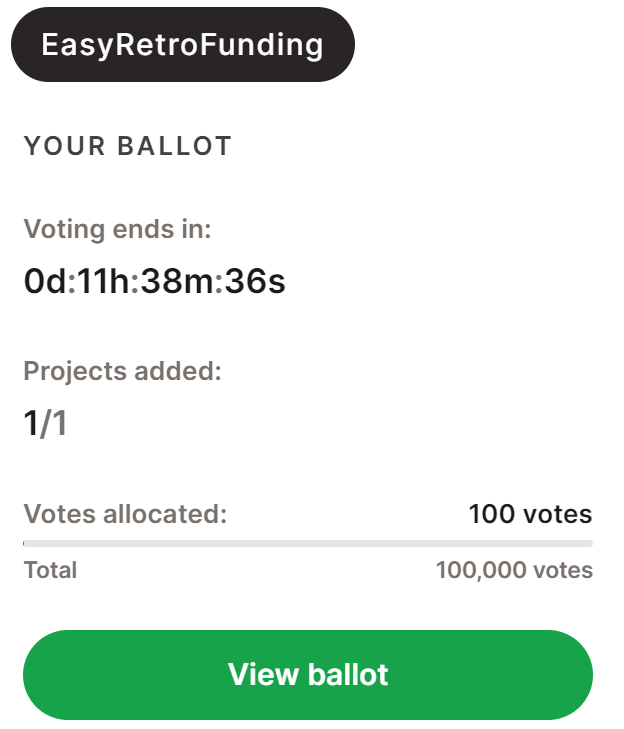

# Voting

Approved stakeholders (such as select community members) are encouraged to participate in round voting. These members must be manually added to a whitelist by an admin, which emits an onchain transaction.

Voters review and support applications they find the most worthy of funding. Projects that receive more votes will receive more funding, up to maximums set by the round admin.

<figure><figcaption></figcaption></figure>

A ballot can be submitted at any point during the voting period, but cannot be changed once submitted.

At the end of the voting period a round admin will tally votes, and begin the token distribution process.
